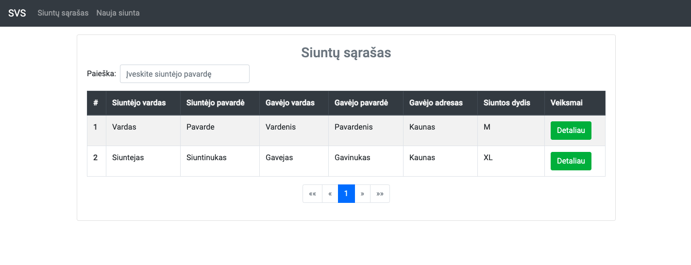
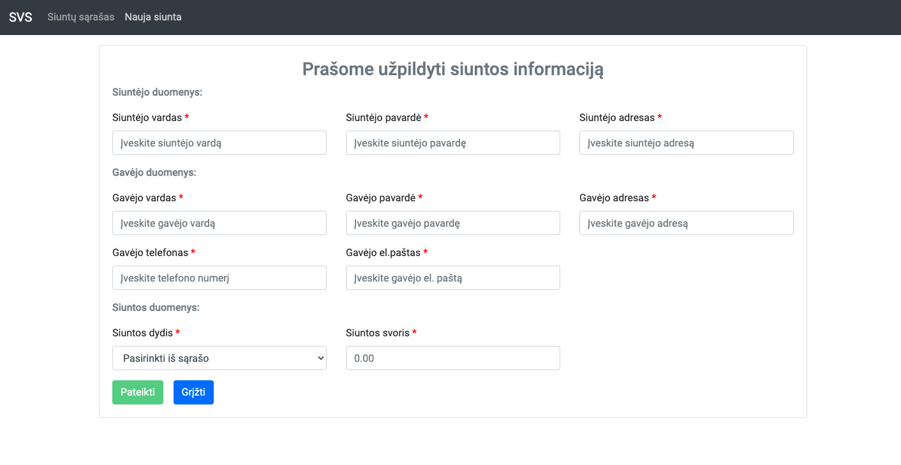
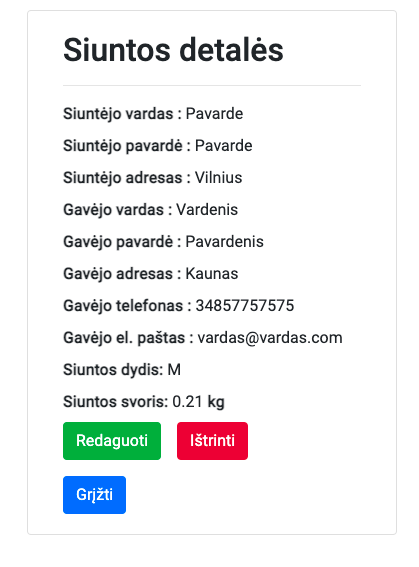
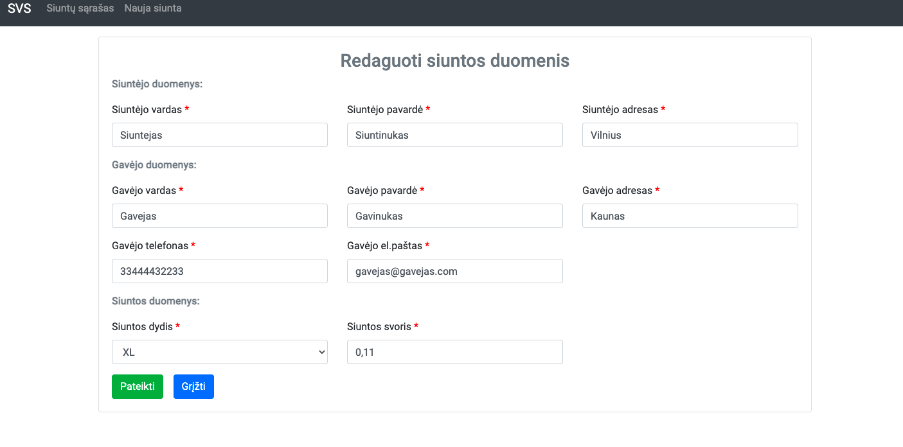

# svs-app
Siuntos valdymos sistema

***
### Description
Simple parcel-sender-reciever input and view form app for collecting info
The project language lithuanian.  
The project is for learning purpose.  

### Technology Stack
Component         | Technology
---               | ---
Frontend          | Angular 12.+
Backend           | Spring Boot 2.1+, Java 11+
Database          | H2 Database
Server            | TomcatApache 9.+
API Documentation | Swagger-UI

### screenshots
Home page info
<p align="center">
  
</p>

Add parcel form info
<p align="center">
  
</p>

Details view info
<p align="center">
  
</p>

Edit form info
<p align="center">
  
</p>

### Prerequisites
-  Clone the repo `https://github.com/VaivaSvegzdaite/svs-app.git`

### Backend and Frontend
- Go to your project folder from your terminal
- cd app
- Run: `mvn spring-boot:run`

- Go to your project folder from your terminal
- cd app-ui
- Run: `ng serve`
- It will open your browser(http://localhost:4200)

### Database 
- http://localhost:8080/console
```
  datasource.url=jdbc:h2:file://tmp/test7555.db
  username: sa
  password:
```

### Swagger UI
- http://localhost:8080/swagger-ui/

***
Copyright ©VaivaSvegzdaite, 2021
